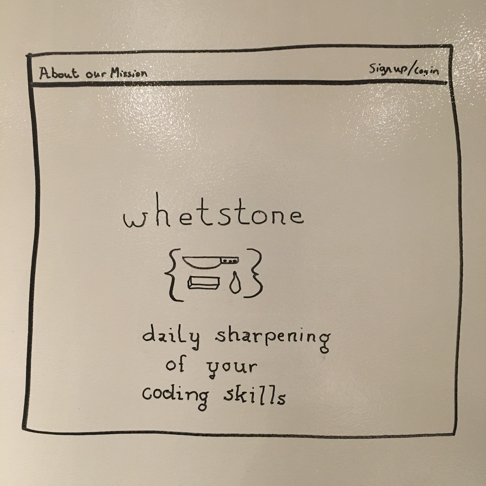
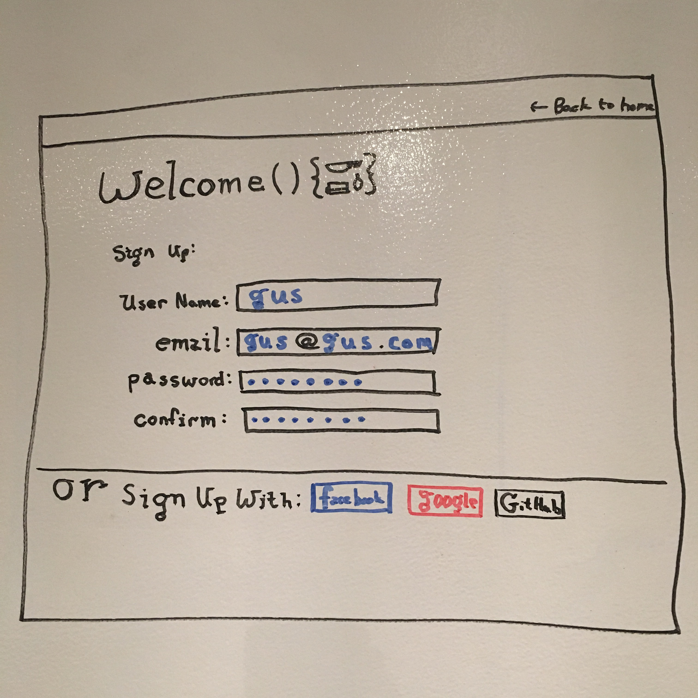
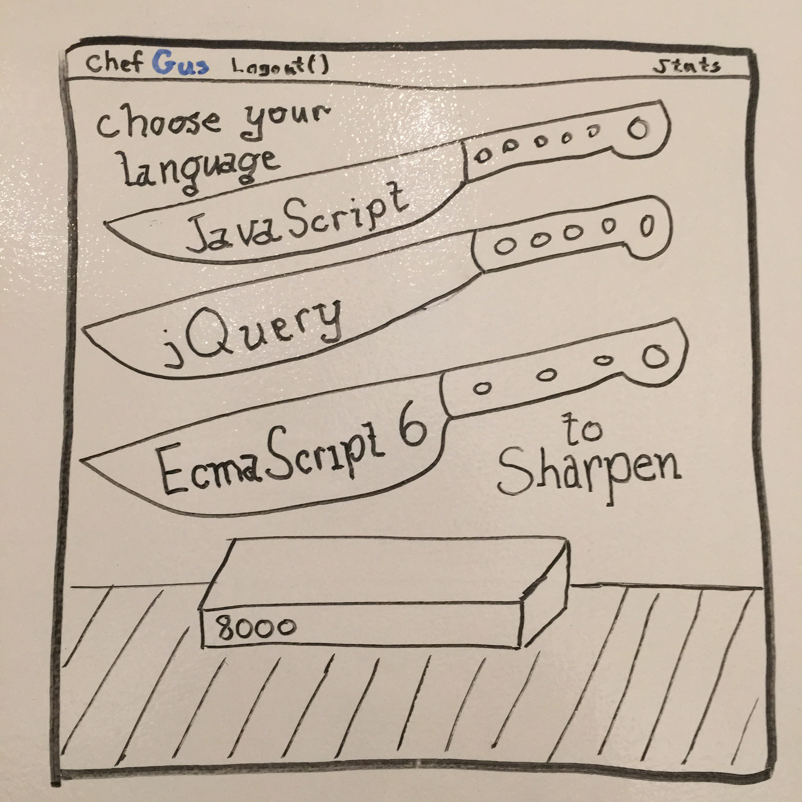
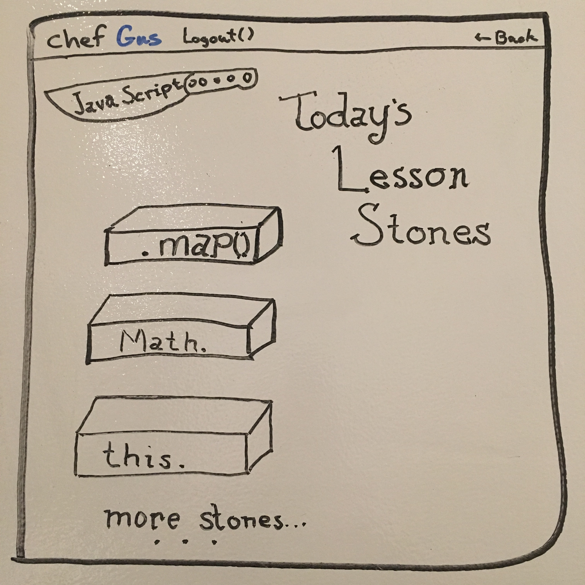
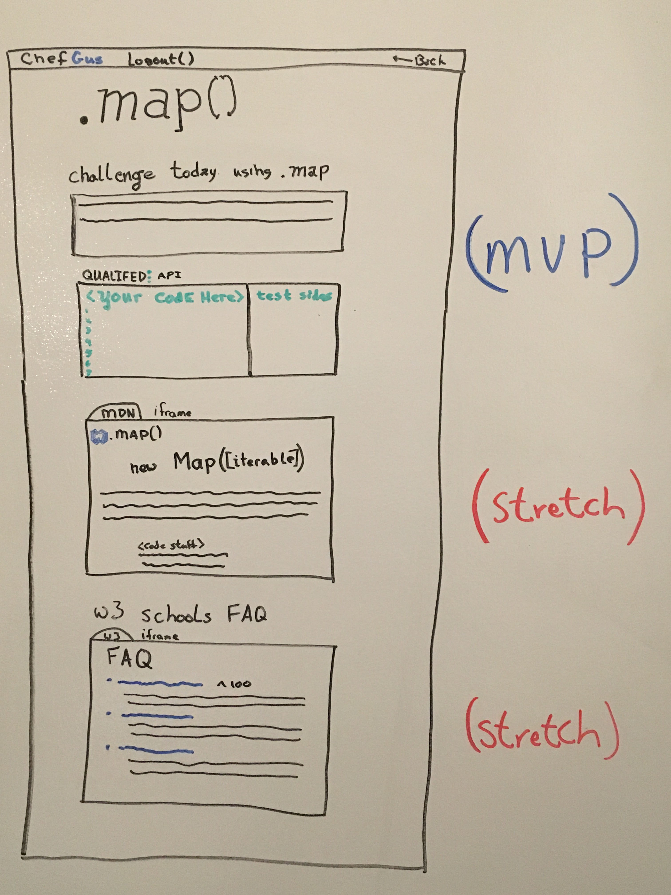
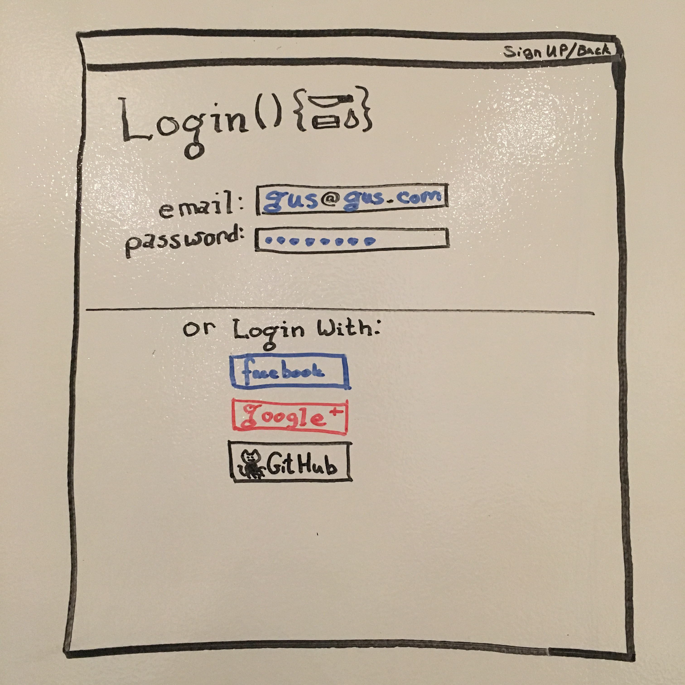

# Whetstone

> Whetstone is a web application that new and experienced developers can use to expand their programming vocabulary.

> Built by [Brian](https://github.com/Brian60657), [James](https://github.com/JMEssex), [Gus](https://github.com/gnordhielm), and [Matt](https://github.com/mld78) - the CRUD Studs.

### Installation

1. Clone or download this repository to your machine.
2. Confirm you have `Node.js` installed by running `node -v` (I have `v6.9.4`).

> If you aren't getting a version number, head over to https://nodejs.org/en/download/ and download it.

3. `cd` into the root of your local copy of the app and run `npm install`.
4. Start the database server with `mongod`.
5. In a new terminal tab (staying in the root), seed the database with `node config/seeds`
6. Start the server with `nodemon` or `node server.js`.
7. Navigate to `localhost:3000`, and you're good to go!

### Technologies Used

Whetstone is a **Node.js** app which uses **express** and **mongoDB**, mediated by **mongoose**. It uses the **ejs** library for dynamic pages and **jQuery** for server-side ajax. 

Exercise code is evaluated by the **HackerEarth** API, facilitated by the **HackerEarth-node** library. 

User authentication is implemented with **passport** - which is set up to support local authentication and **Facebook** authentication.

### Process

Here are public links for our [user stories](https://trello.com/b/xufvXcpc/crud-studs-whetstone) and our [pitch deck](https://prezi.com/pibq6kokc1u9/whetstone/?utm_campaign=share&utm_medium=copy).

Whetstone was conceived to fit a niche need that developers new and experienced, employed as contractors or full-time all have: I know the basics, now how do I round out my knowledge. Documentation is important for reference, but too haphazard to learn from - nobody learns English by flipping through the dictionary. 

At the end of our initial sprint, we had achieved a **minimum viable product** which...

* Was deployed on Heroku, accessible to anyone.
* Had a sign-up page, which allowed anyone to create a secure account.
* Had a few basic exercises in **JavaScript**.
* Had a dashboard page, where an authenticated user could see which exercises they have completed.
* Was able to evaluate code and run tests.
* Made our methods library accessible to developers via a simple API.
* Stored user information and exercises with mongoDB.

**Wireframes**
 
             
 

**Initial ERD**

 

### Next Steps

We only had a week to put this project together, so the primary concern wasn't bells and whistles - it was the minimum viable product. However, we believe Whetstone does have a place in the daily routine of a professional programmer. Consider the challenge of learning ES6 or moving from Python 2.7 to Python 3. You don't want a beginner's tutorial, you want to leverage what you already know to achieve proficiency in a new topic. With that goal in mind, there are still a number of **planned features** we'd like to implement:

* Authentication with Google
* Exercise completion playback (a la **Qualified.io**)
* More robust logic behind serving exercises
* More robust storage of a user's proficiencies
* Lots more exercises, perhaps 

Before we get to all that, we also have a number of **unsolved problems** to attend to:

* A better evaluation solution, once we run 1000 evaluations the API will block our requests.
* Recurrent errors in our .ejs files - which disappear magically with apparently no changes.
* Our sessions implementation (`connect.session()`) isn't ideal for production and is not scalable.

